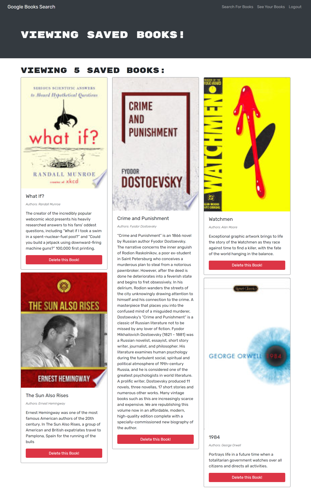

# **Book Search Engine** 

## **Description**
My task was to convert the existing RESTful API to a GraphQL API built with Apollo Server.

## **Table of Contents**
* [Application](#application)
* [Deployed](#deployed)
* [Usage](#usage)
* [Technology](#technology)
* [License](#license)
* [Contact](#contact)

***

## **Application**
### Book Search Page

### Saved Books Page

## **Deployed:**
[Google Book Search](https://albenchris-book-search.herokuapp.com/)

***

## **Usage**
Any user can search for books. If a user would like to save books, they would have to login or sign up. Once logged in, the user can save a book by clicking the "Save this Book!" button. Once no longer needed, the user can remove the book with the "Delete this Book!" button.

***

## **Technology**
* MongoDB
* Express.js
* React.js
* Node.js
* Mongoose
* Apollo Server
* GraphQL
* Google Books API
* Bootstrap

***

## **License**
[ISC](https://opensource.org/licenses/ISC)

***

## **Contact**
Feel free to contact me with any questions or comments!
* Github: [albenchris](https://github.com/albenchris)
* LinkedIn: [Alexander Christopherson](https://www.linkedin.com/in/alexander-christopherson-2b32085a/)
* Email: albenchris00@gmail.com
